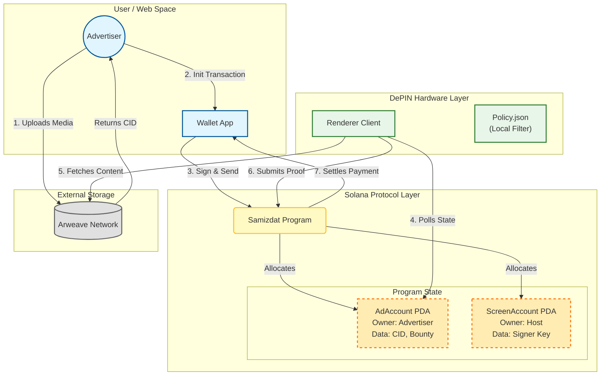
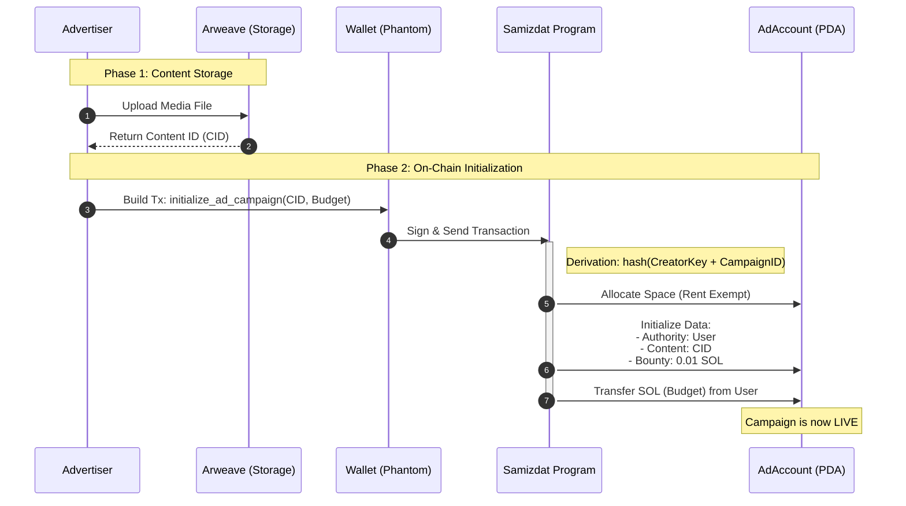
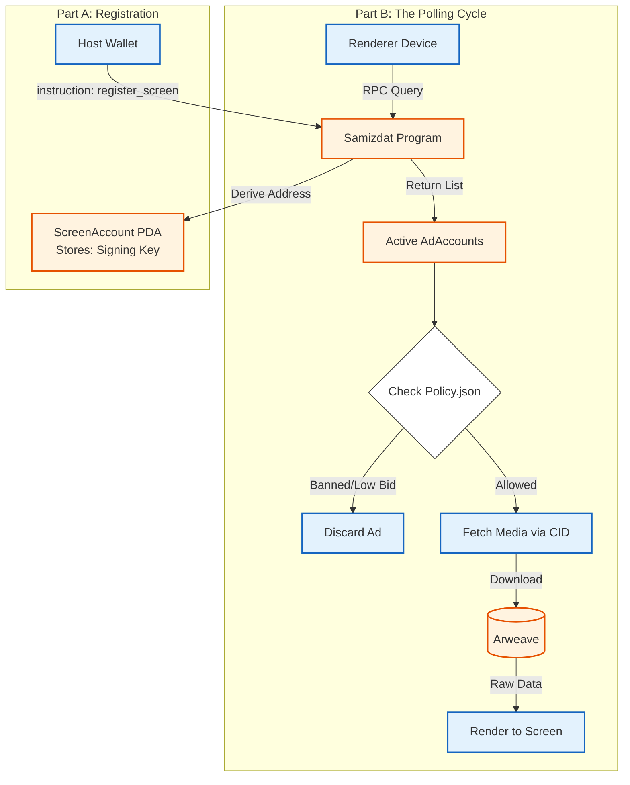
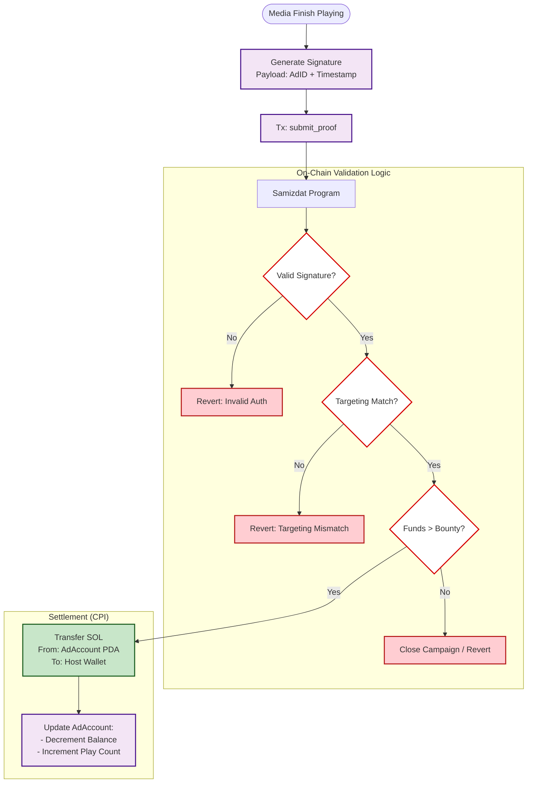

# Samizdat Protocol

**Decentralized Digital Signage Network (DePIN) on Solana.**
A "Sovereign Frame Buffer" that decouples content storage from rendering. Advertisers fund campaigns on-chain; hardware owners (Screens) poll for content, render it, and submit cryptographic proofs to claim bounties.

## Architecture

> [!IMPORTANT]
> The current architecture is for reference only, the end product might look different.

### System Overview
Advertisers interact with the blockchain to fund campaigns. Screens (Physical or Virtual) act as autonomous agents that poll the chain, filter content via local policies, and sign proofs of play to unlock payments.

### Ad Creation

### Hardware Registration and Polling

### Proof of Play and Settlement

