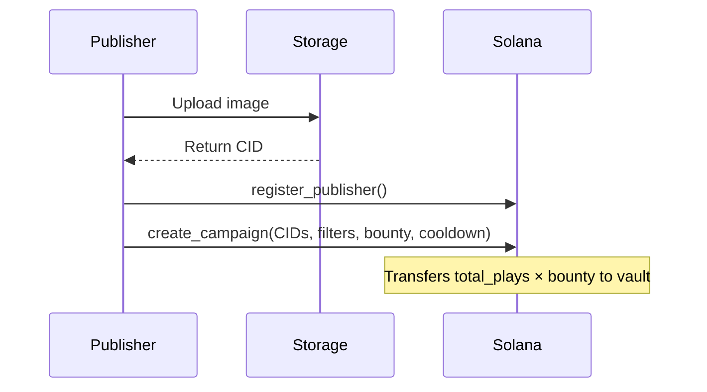
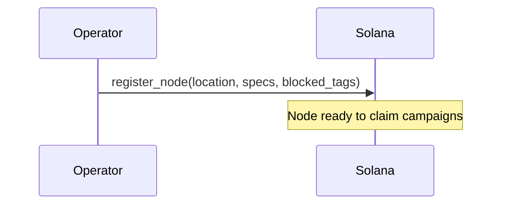
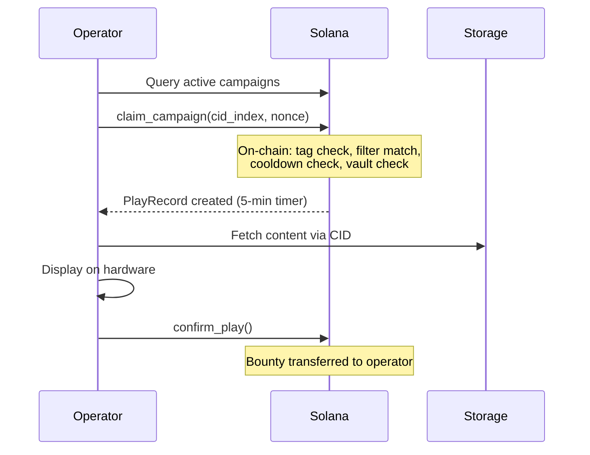
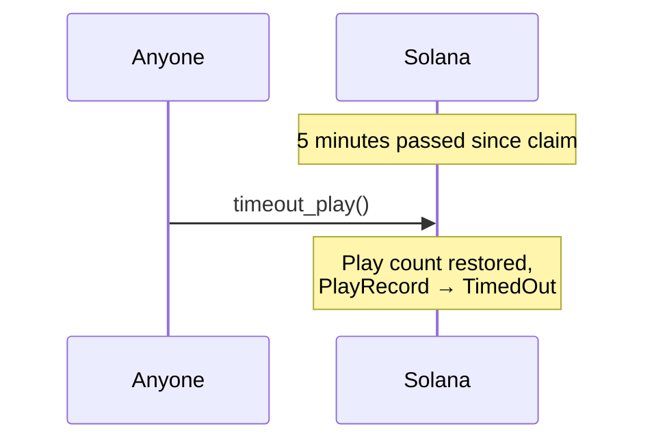

# Samizdat Architecture

## Overview

Samizdat creates a two-sided marketplace for content distribution on physical displays. Publishers create campaigns with targeting criteria, operators run display nodes that autonomously discover and show eligible content.

## Actors

**Publisher**: Entity that creates campaigns, uploads content to decentralized storage, and funds displays.

**Operator**: Entity that runs display nodes (screens), discovers campaigns, validates content, and earns bounties.

## Core Concepts

### Content Storage
Content (images) lives off-chain on Arweave/IPFS, referenced by CID. Publishers upload content independently, then reference CIDs on-chain.

### Matching
Operators query on-chain state to discover campaigns. All targeting filters are enforced **on-chain** at claim time — geo bounds, footfall range, screen size, establishment type, landmarks, and content tag masks are all validated by the program.

### Payment
Publishers fully fund campaigns at creation (`total_plays × bounty_per_play` transferred upfront). Additional funding can be added later via `fund_campaign`. When operators confirm display, bounty transfers directly from the campaign vault to the operator's wallet.

### Cooldown
Publishers set a `claim_cooldown` (seconds) per campaign. The same node cannot re-claim the same campaign until the cooldown has elapsed. This prevents a single node from monopolizing all play slots.

### Timeout Protection
After claiming a campaign, operators have 5 minutes (300s) to confirm display. If timeout expires without confirmation, anyone can call `timeout_play` to restore the play count.

## Account Structure

See [Account Reference](./accounts.md) for detailed specifications.

- **PublisherAccount**: Publisher identity and aggregate stats
- **CampaignAccount**: Campaign state (CIDs, targeting, bounty, vault, cooldown)
- **NodeAccount**: Display node state (location, specs, filters, earnings)
- **PlayRecord**: Individual display tracking (claim → confirm → payment)
- **ClaimCooldown**: Per-(campaign, node) cooldown tracker

## State Machines

### CampaignAccount States

```
[Created] → Active ←→ Paused
               ↓          ↓
           Depleted ──→ Paused (via fund_campaign)
               ↓          ↓
             Closed     Closed
```

- **Active**: Accepting claims from operators
- **Paused**: Temporarily stopped; publisher must reactivate manually
- **Depleted**: No plays remaining; funding auto-transitions to Paused
- **Closed**: Permanently closed, remaining funds returned (terminal)

> Publishers can update any non-Closed campaign. Closed is only settable via `close_campaign`.

### PlayRecord States

```
[Created] → Claimed → Paid
                ↘ TimedOut
```

- **Claimed**: Operator claimed, 5-minute window active
- **Paid**: Bounty transferred to operator
- **TimedOut**: Claim expired without confirmation, play count restored

## Workflows

### Campaign Creation



### Node Registration



### Display Cycle



### Timeout Recovery



## On-Chain Filter Matching

All targeting validation happens in the `claim_campaign` instruction:

| Filter | Check |
|---|---|
| Content tags | `campaign.tag_mask & node.blocked_tag_mask == 0` |
| Footfall | Node within `min_footfall..=max_footfall` range |
| Screen size | Node's size in campaign's accepted list |
| Geo bounds | Node lat/lon within campaign's bounding box |
| Establishment | Node's type in campaign's accepted list |
| Landmarks | Node has all required landmarks |
| Cooldown | `now >= last_claimed_at + claim_cooldown` |
| Vault | Excess lamports ≥ `bounty_per_play` |

## Security Model

### Authority Checks
All mutable operations require signature from the account authority (enforced via Anchor `has_one` constraints):
- Only a publisher can modify their campaigns
- Only an operator can modify their node and confirm plays

### Economic Security
- Campaigns are fully funded at creation (`total_plays × bounty_per_play`)
- Additional funding possible via `fund_campaign`
- Vault balance checked at claim time (rent-exempt guard)
- Timeout mechanism prevents operators from locking plays indefinitely

### Content Safety
- Operators define `blocked_tag_mask` — enforced on-chain at claim time
- Operators can additionally validate content locally before display
- Publishers can add CIDs but cannot modify existing ones

### Cooldown Protection
- Publisher-defined `claim_cooldown` prevents a single node from draining all play slots
- Tracked via per-(campaign, node) `ClaimCooldown` PDA

## Performance Considerations

### Polling Strategy
Operators should:
- Poll every 30–60 seconds
- Use `getProgramAccounts` with memcmp filters for campaign status
- Cache locally to reduce RPC load
- Use Geyser/indexer for production

### Scaling
For high-throughput deployments:
- Geyser plugin to index accounts
- Web2 API for fast campaign discovery
- WebSocket subscriptions for real-time updates

---

**See Also:**
- [Account Structures](./accounts.md)
- [Instructions Reference](./instructions.md)
- [Error Codes](./errors.md)
